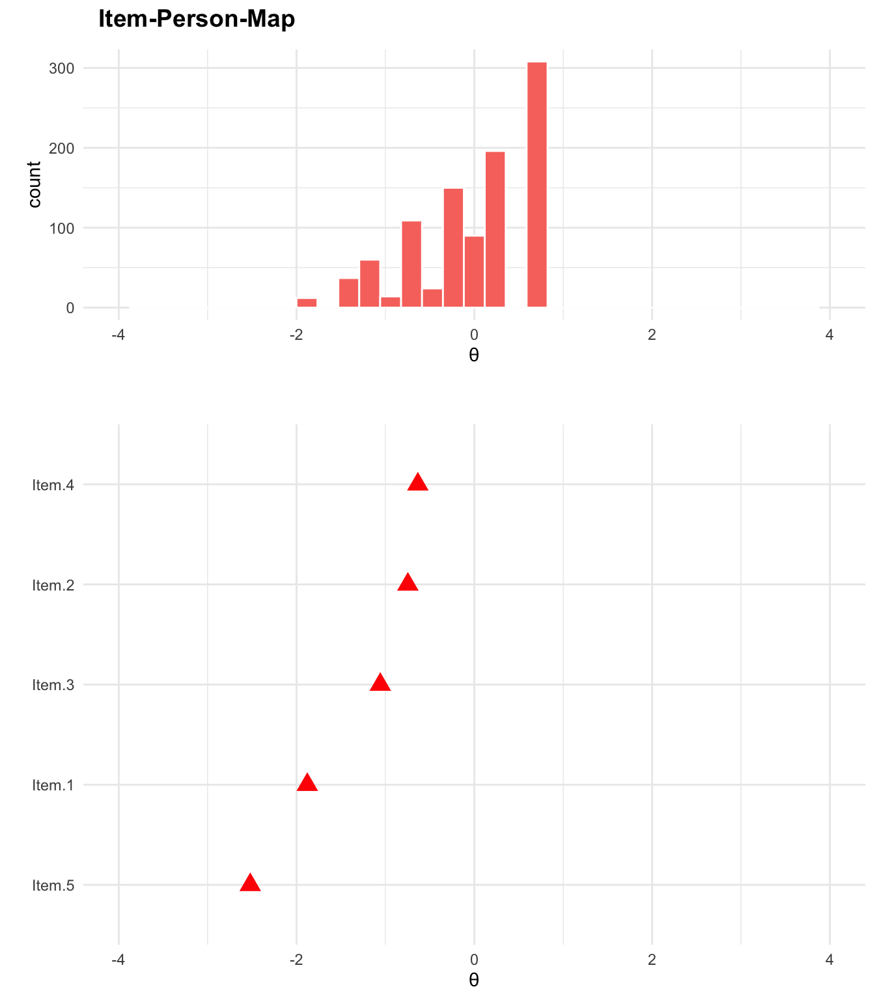

<!-- README.md is generated from README.Rmd. Please edit that file -->

<div style="padding-top:1em; padding-bottom: 0.5em;">


</div>

# ggmirt

This package provides convenient plotting functions to extend the great
package “mirt” with ggplot-based plotting functions. Additionally, it
includes some additional summary functions.

### Installation

``` r
# install.packages("devtools")
devtools::install_github("masurp/ggmirt")
```

### Usage

``` r
# Load packages
library(mirt)
library(ggmirt)

# Get some data
data <- expand.table(LSAT7)

# Run IRT model with mirt
mod <- mirt(data, 1)
#> Iteration: 1, Log-Lik: -2668.786, Max-Change: 0.18243Iteration: 2, Log-Lik: -2663.691, Max-Change: 0.13637Iteration: 3, Log-Lik: -2661.454, Max-Change: 0.10231Iteration: 4, Log-Lik: -2659.430, Max-Change: 0.04181Iteration: 5, Log-Lik: -2659.241, Max-Change: 0.03417Iteration: 6, Log-Lik: -2659.113, Max-Change: 0.02911Iteration: 7, Log-Lik: -2658.812, Max-Change: 0.00456Iteration: 8, Log-Lik: -2658.809, Max-Change: 0.00363Iteration: 9, Log-Lik: -2658.808, Max-Change: 0.00273Iteration: 10, Log-Lik: -2658.806, Max-Change: 0.00144Iteration: 11, Log-Lik: -2658.806, Max-Change: 0.00118Iteration: 12, Log-Lik: -2658.806, Max-Change: 0.00101Iteration: 13, Log-Lik: -2658.805, Max-Change: 0.00042Iteration: 14, Log-Lik: -2658.805, Max-Change: 0.00025Iteration: 15, Log-Lik: -2658.805, Max-Change: 0.00026Iteration: 16, Log-Lik: -2658.805, Max-Change: 0.00023Iteration: 17, Log-Lik: -2658.805, Max-Change: 0.00023Iteration: 18, Log-Lik: -2658.805, Max-Change: 0.00021Iteration: 19, Log-Lik: -2658.805, Max-Change: 0.00019Iteration: 20, Log-Lik: -2658.805, Max-Change: 0.00017Iteration: 21, Log-Lik: -2658.805, Max-Change: 0.00017Iteration: 22, Log-Lik: -2658.805, Max-Change: 0.00015Iteration: 23, Log-Lik: -2658.805, Max-Change: 0.00015Iteration: 24, Log-Lik: -2658.805, Max-Change: 0.00013Iteration: 25, Log-Lik: -2658.805, Max-Change: 0.00013Iteration: 26, Log-Lik: -2658.805, Max-Change: 0.00011Iteration: 27, Log-Lik: -2658.805, Max-Change: 0.00011Iteration: 28, Log-Lik: -2658.805, Max-Change: 0.00010

# Use functions from the package
itempersonMap(mod, color = "red", size = 4, shape = 17)
```



### How to cite this package

``` r
citation("ggmirt")
#> Warning in citation("ggmirt"): no date field in DESCRIPTION file of package
#> 'ggmirt'
#> 
#> To cite package 'ggmirt' in publications use:
#> 
#>   Philipp K. Masur (2022). ggmirt: Additional plotting and summary
#>   functions for IRT analyses with mirt. R package version 0.0.0.9000.
#> 
#> A BibTeX entry for LaTeX users is
#> 
#>   @Manual{,
#>     title = {ggmirt: Additional plotting and summary functions for IRT analyses with
#> mirt},
#>     author = {Philipp K. Masur},
#>     year = {2022},
#>     note = {R package version 0.0.0.9000},
#>   }
```
