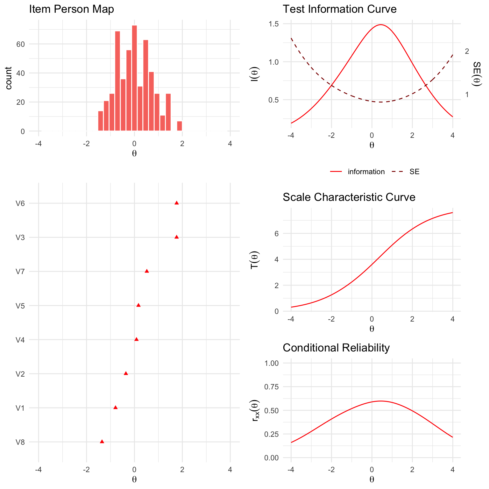

<!-- README.md is generated from README.Rmd. Please edit that file -->

<div style="padding-top:1em; padding-bottom: 0.5em;">


</div>

# ggmirt

<!-- badges: start -->

[](https://www.tidyverse.org/lifecycle/#experimental)
[](https://CRAN.R-project.org/package=ggmirt)
<!-- badges: end -->

This package extends the great R-package
[`mirt`](https://github.com/philchalmers/mirt) (Multidimensional item
response theory; Chalmers, 2021) with functions for creating
publication-ready and customizable figures. Although the `mirt`-packages
already includes possibilities to plot various aspects relevant to
understanding IRT analyses (e.g., item plots, trace-plots, etc.), it
does not employ `ggplot2`, which provides more flexibility and
customizability. This package provides some functions to recreate such
plots with ggplot2.

If you want to learn how to use `mirt` in combination with `ggmirt` to
run various IRT analyses, please check out the following tutorials:

-   [Item Response Theory I: 3PL, 2PL, & 1PL (Rasch)
    models](https://github.com/ccs-amsterdam/r-course-material/blob/master/tutorials/R_test-theory_3_irt.md)
-   [Item Response Theory II: Graded response
    models](https://github.com/ccs-amsterdam/r-course-material/blob/master/tutorials/R_test-theory_3_irt_graded.md)

**Please note:** This package is still under development. It is
currently rather a place where I dump some functions that I use often,
but I have not fully tested them under different scenarios and with
different type of models. If you are interested in contributing, feel
free to reach out.

### Installation

``` r
# install.packages("devtools")
devtools::install_github("masurp/ggmirt")
```

### Usage

``` r
# Load packages
library(mirt)
library(ggmirt)

# Simulate some data
data <- sim_irt(500, 8, seed = 123)

# Run IRT model with mirt
mod <- mirt(data, 1, itemtype = "2PL", verbose = FALSE)

# Plot item-person map
itempersonMap(mod)
```


``` r
# Item characteristic curves
tracePlot(mod, data)
```


``` r
# Item information curves
itemInfoPlot(mod, data)
```


``` r
# Scale characteristic curve
scaleCharPlot(mod)
```


``` r
# Test information curves
testInfoPlot(mod, adj_factor = 1.75)
```


``` r
# Item infit and outfit statistics
itemfitPlot(mod)
```


``` r
# Person fit statisitcs
personfitPlot(mod)
```


``` r
# Conditional reliability
conRelPlot(mod)
```


Next to individual plot functions, there is also a comprehensive
summaryPlot()-function, which provides a lot of information about IRT
models with just a line of code.

``` r
summaryPlot(mod, adj_factor = 1.75)
```



### How to cite this package

``` r
citation("ggmirt")
#> 
#> To cite package 'ggmirt' in publications use:
#> 
#>   Philipp K. Masur (2022). ggmirt: Plotting functions to extend "mirt"
#>   for IRT analyses. R package version 0.1.0.
#> 
#> A BibTeX entry for LaTeX users is
#> 
#>   @Manual{,
#>     title = {ggmirt: Plotting functions to extend "mirt" for IRT analyses},
#>     author = {Philipp K. Masur},
#>     year = {2022},
#>     note = {R package version 0.1.0},
#>   }
```
