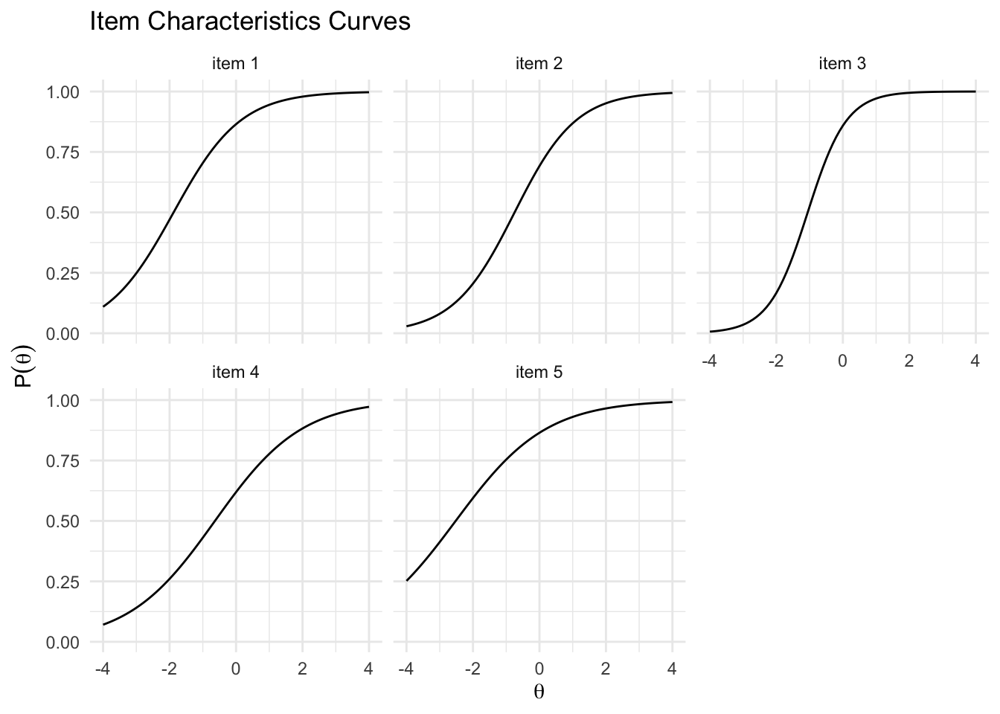
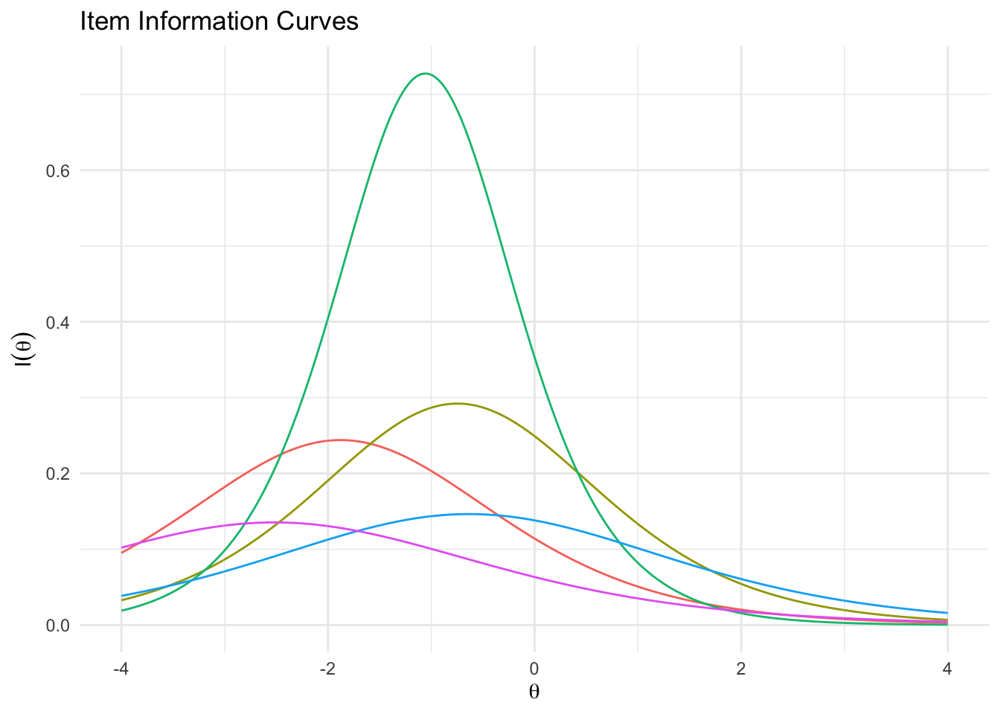
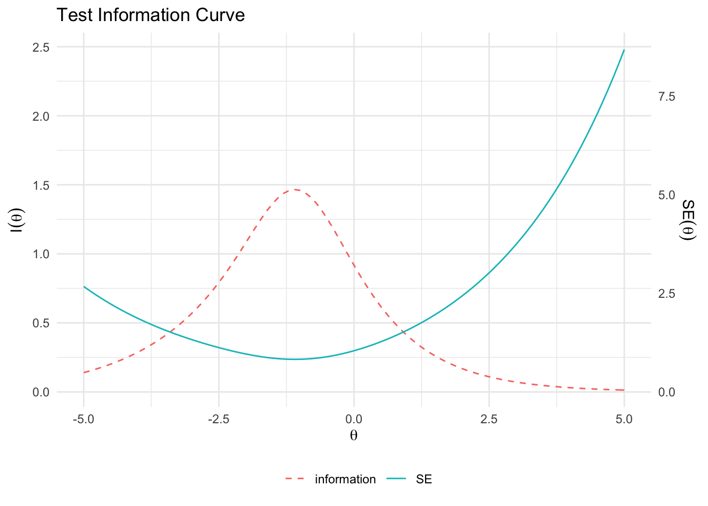
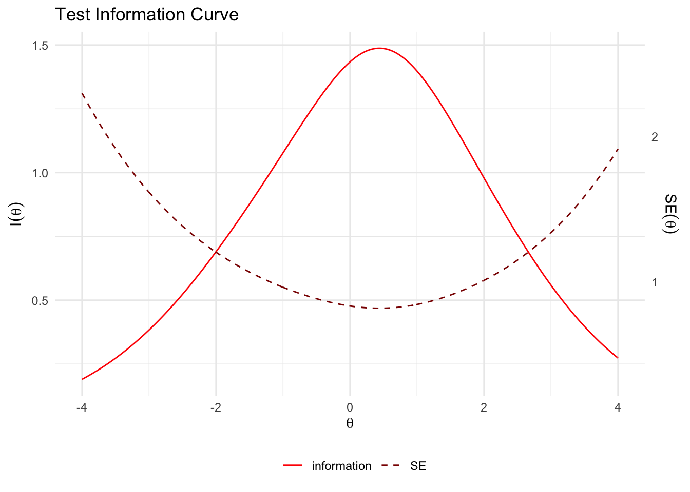
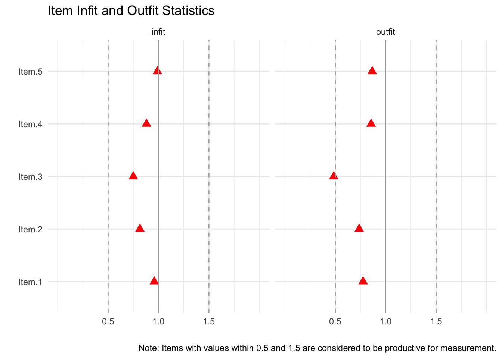
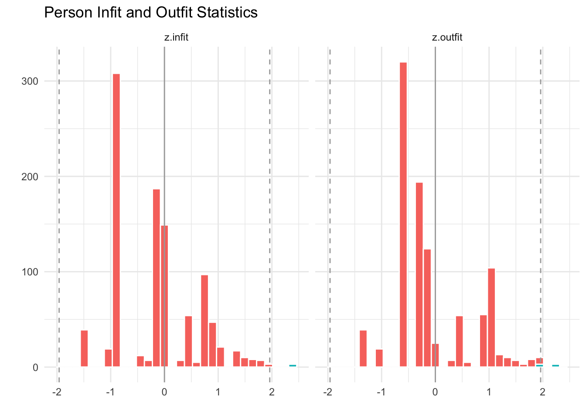
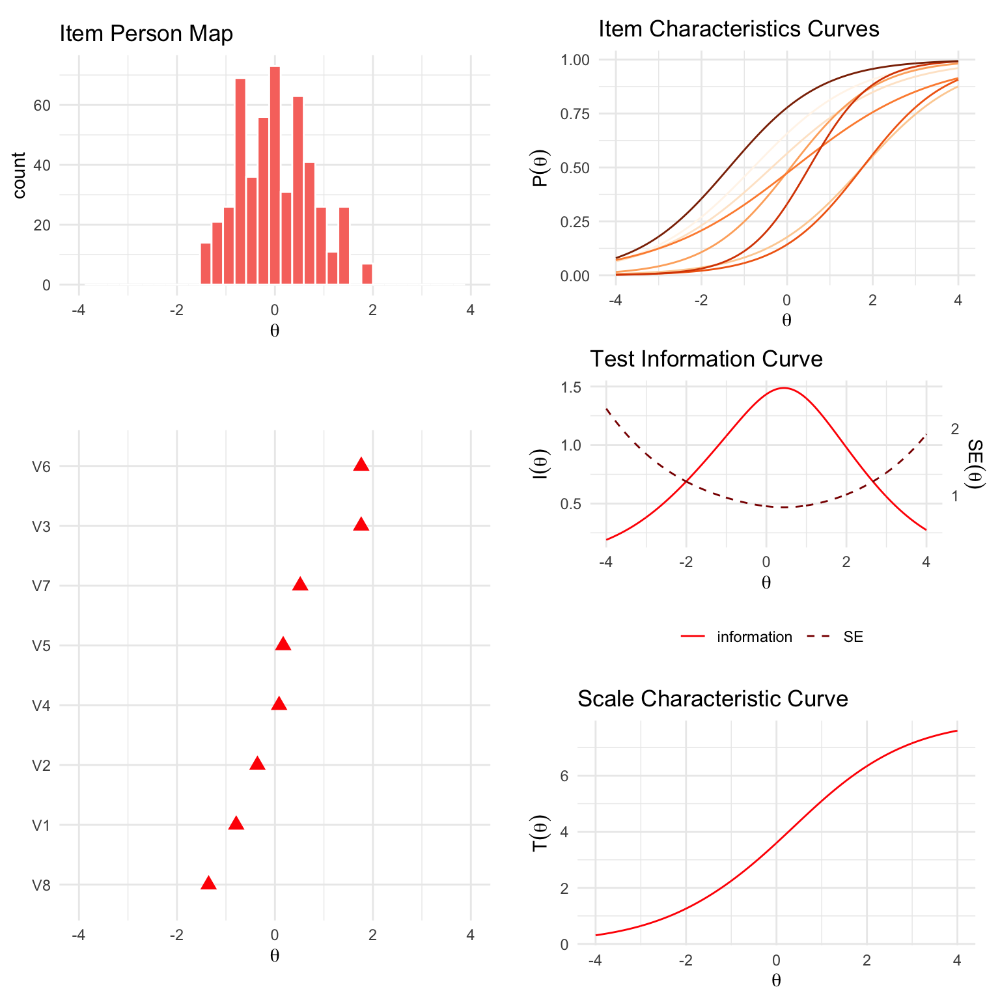

<!-- README.md is generated from README.Rmd. Please edit that file -->

<div style="padding-top:1em; padding-bottom: 0.5em;">


</div>

# ggmirt

<!-- badges: start -->

[](https://www.tidyverse.org/lifecycle/#experimental)
[](https://CRAN.R-project.org/package=ggmirt)
<!-- badges: end -->

This package extends the great R-package
[`mirt`](https://github.com/philchalmers/mirt) (Multidimensional item
response theory; Chalmers, 2021) with functions for creating
publication-ready and customizable figures. Although the `mirt`-packages
already includes possibilities to plot various aspects relevant to
understanding IRT analyses (e.g., item plots, trace-plots, etc.), it
does not employ `ggplot2`, which provides more flexibility and
customizability. This package provides some functions to recreate such
plots with ggplot2.

**Please note:** This package is still under development. It is
currently rather a place where I dump some functions that I use often,
but I have not fully tested them under different scenarios and with
different type of models. If you are interested in contributing, feel
free to reach out.

### Installation

``` r
# install.packages("devtools")
devtools::install_github("masurp/ggmirt")
```

### Usage

``` r
# Load packages
library(mirt)
library(ggmirt)

# Get some data
data <- expand.table(LSAT7)

# Run IRT model with mirt
mod <- mirt(data, 1)
#> Iteration: 1, Log-Lik: -2668.786, Max-Change: 0.18243Iteration: 2, Log-Lik: -2663.691, Max-Change: 0.13637Iteration: 3, Log-Lik: -2661.454, Max-Change: 0.10231Iteration: 4, Log-Lik: -2659.430, Max-Change: 0.04181Iteration: 5, Log-Lik: -2659.241, Max-Change: 0.03417Iteration: 6, Log-Lik: -2659.113, Max-Change: 0.02911Iteration: 7, Log-Lik: -2658.812, Max-Change: 0.00456Iteration: 8, Log-Lik: -2658.809, Max-Change: 0.00363Iteration: 9, Log-Lik: -2658.808, Max-Change: 0.00273Iteration: 10, Log-Lik: -2658.806, Max-Change: 0.00144Iteration: 11, Log-Lik: -2658.806, Max-Change: 0.00118Iteration: 12, Log-Lik: -2658.806, Max-Change: 0.00101Iteration: 13, Log-Lik: -2658.805, Max-Change: 0.00042Iteration: 14, Log-Lik: -2658.805, Max-Change: 0.00025Iteration: 15, Log-Lik: -2658.805, Max-Change: 0.00026Iteration: 16, Log-Lik: -2658.805, Max-Change: 0.00023Iteration: 17, Log-Lik: -2658.805, Max-Change: 0.00023Iteration: 18, Log-Lik: -2658.805, Max-Change: 0.00021Iteration: 19, Log-Lik: -2658.805, Max-Change: 0.00019Iteration: 20, Log-Lik: -2658.805, Max-Change: 0.00017Iteration: 21, Log-Lik: -2658.805, Max-Change: 0.00017Iteration: 22, Log-Lik: -2658.805, Max-Change: 0.00015Iteration: 23, Log-Lik: -2658.805, Max-Change: 0.00015Iteration: 24, Log-Lik: -2658.805, Max-Change: 0.00013Iteration: 25, Log-Lik: -2658.805, Max-Change: 0.00013Iteration: 26, Log-Lik: -2658.805, Max-Change: 0.00011Iteration: 27, Log-Lik: -2658.805, Max-Change: 0.00011Iteration: 28, Log-Lik: -2658.805, Max-Change: 0.00010

# Plot item-person map
itempersonMap(mod)
```


``` r
# Plot trace lines (item characteristic curves)
tracePlot(mod, data)
```



``` r
# Plot trace lines (item characteristic curves)
itemInfoPlot(mod, data)
```



``` r
# Plot scale characteristic curve
scaleCharPlot(mod)
```



``` r
# Plot test information curves
testInfoPlot(mod)
```



``` r
# Plot item infit and outfit statistics
itemfitPlot(mod)
```



``` r
# Plot person fit
personfitPlot(mod)
```



Next to individual plot functions, there is also a comprehensive
summaryPlot()-function, which provides a lot of information about IRT
models with just a line of code.

``` r
summaryPlot(mod, data, theta_range = c(-5, 4), adj_factor = 4)
```



### How to cite this package

``` r
citation("ggmirt")
#> 
#> To cite package 'ggmirt' in publications use:
#> 
#>   Philipp K. Masur (2022). ggmirt: Plotting functions to extend "mirt"
#>   for IRT analyses. R package version 0.1.0.
#> 
#> A BibTeX entry for LaTeX users is
#> 
#>   @Manual{,
#>     title = {ggmirt: Plotting functions to extend "mirt" for IRT analyses},
#>     author = {Philipp K. Masur},
#>     year = {2022},
#>     note = {R package version 0.1.0},
#>   }
```
