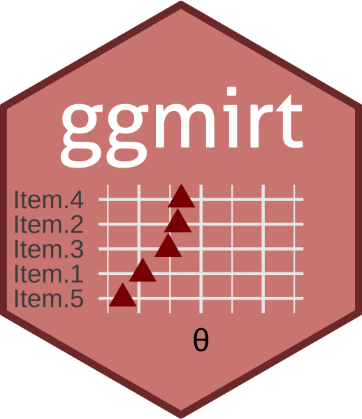

<!-- README.md is generated from README.Rmd. Please edit that file -->

```{r, include = FALSE}
knitr::opts_chunk$set(
  collapse = TRUE,
  comment = "#>",
  fig.path = "man/figures/README-",
  out.width = "100%",
  fig.retina = 2
)
```


<div style = "padding-top:1em; padding-bottom: 0.5em;">

</div>


# ggmirt

<!-- badges: start -->
[](https://www.tidyverse.org/lifecycle/#experimental)
[](https://CRAN.R-project.org/package=ggmirt)
<!-- badges: end -->

This package extends the great R-package [`mirt`](https://github.com/philchalmers/mirt) (Multidimensional item response theory; Chalmers, 2021) with functions for creating publication-ready and customizable figures. Although the `mirt`-packages already includes possibilities to plot various aspects relevant to understanding IRT analyses (e.g., item plots, trace-plots, etc.), it does not employ `ggplot2`, which provides more flexibility and customizability. This package provides some functions to recreate such plots with ggplot2. 

**Please note:** This package is still under development. It is currently rather a place where I dump some functions that I use often, but I have not fully tested them under different scenarios and with different type of models. If you are interested in contributing, feel free to reach out.  


### Installation

``` r
# install.packages("devtools")
devtools::install_github("masurp/ggmirt")
```


### Usage

```{r, message=F, warning = F, fig.width=7, fig.height=8.5}
# Load packages
library(mirt)
library(ggmirt)

# Get some data
data <- expand.table(LSAT7)

# Run IRT model with mirt
mod <- mirt(data, 1)

# Plot item-person map
itempersonMap(mod, color = "red", size = 4, shape = 17)
```


```{r, message=F, warning = F}
# Plot trace lines (item characteristic curves)
tracePlot(mod, data)
```


```{r, message=F, warning = F}
# Plot trace lines (item characteristic curves)
itemInfoPlot(mod, data, theta_range = seq(-5,5, by = .1), facet = F)
```


```{r, message=F, warning = F}
# Plot test information curves
testInfoPlot(mod, theta_range = seq(-5,5, by = .1))
```


```{r, message=F, warning = F}
# Plot item infit and outfit statistics
itemfitPlot(mod)
```


### How to cite this package

```{r}
citation("ggmirt")
```


